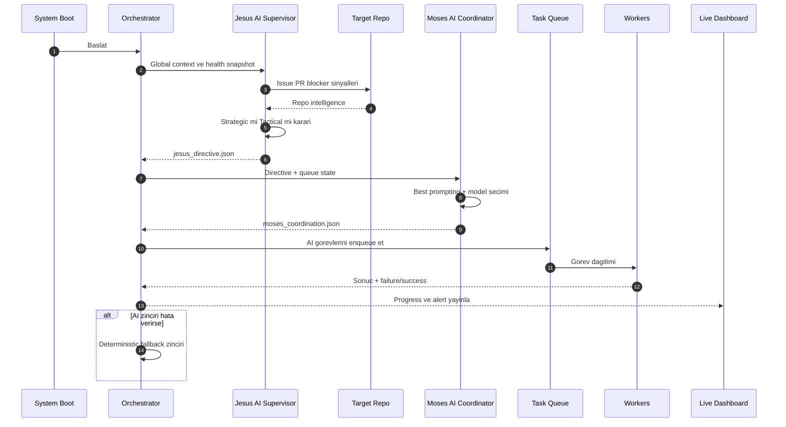
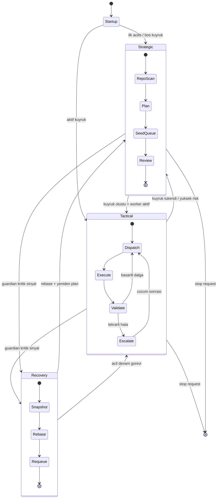

# BOX Yeni Mimari Diyagramlari

Bu dokumanda yeni AI-driven mimari 3 farkli bakis acisi ile cizilmistir:

- Katmanli genel gorunum (sistemin tum bloklari)
- Liderlik ve karar akis sekansi (Jesus -> Moses -> Worker)
- Runtime mod gecis diyagrami (Strategic/Tactical/Recovery)

## 1) Katmanli Genel Gorunum

```mermaid
flowchart LR
  classDef core fill:#0B3C5D,stroke:#08324d,color:#ffffff,stroke-width:1px;
  classDef ai fill:#1F7A8C,stroke:#145a66,color:#ffffff,stroke-width:1px;
  classDef state fill:#F4D35E,stroke:#c9ab45,color:#1f1f1f,stroke-width:1px;
  classDef runtime fill:#EE964B,stroke:#c6783c,color:#1f1f1f,stroke-width:1px;
  classDef ext fill:#6C757D,stroke:#555d63,color:#ffffff,stroke-width:1px;

  subgraph L1[1) Giris ve Politika]
    CLI[CLI / Daemon]
    CFG[box.config.json]
    POL[policy.json]
  end

  subgraph L2[2) AI Liderlik Zinciri]
    J[Jesus Supervisor AI]
    M[Moses Coordinator AI]
    D1[jesus_directive.json]
    D2[moses_coordination.json]
    J --> D1 --> M --> D2
  end

  subgraph L3[3) Orkestrasyon Cekirdegi]
    O[orchestrator.js]
    Q[task_queue.js]
    P[task_planner.js]
    S[project_scanner.js]
    O --> S --> P --> Q
  end

  subgraph L4[4) Calistirma ve Isci Katmani]
    R[worker_runner.js]
    W1[Worker Backend]
    W2[Worker Frontend]
    W3[Worker QA]
    R --> W1
    R --> W2
    R --> W3
  end

  subgraph L5[5) Durum ve Gozlem]
    ST[state/*.json]
    G[System Guardian]
    DASH[Live Dashboard :8787]
    G --> ST --> DASH
  end

  GH[(GitHub Repo)]
  COP[(Copilot CLI)]

  CLI --> O
  CFG --> O
  POL --> O
  O --> J
  M --> Q
  O --> R
  J --> GH
  M --> COP
  R --> COP
  O --> ST

  class O,Q,P,S core;
  class J,M ai;
  class D1,D2,ST state;
  class R,W1,W2,W3 runtime;
  class GH,COP,CLI,CFG,POL,G,DASH ext;
```

## 2) Liderlik ve Karar Akis Sekansi



## 3) Runtime Mod Gecis Diyagrami



## Hizli Kullanim Notu

- Mimariyi ilk kez anlatirken: 1. diyagram
- Liderlik ve karar sorumluluklarini anlatirken: 2. diyagram
- Operasyon davranisi ve kriz toparlanmayi anlatirken: 3. diyagram
